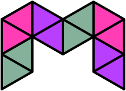

# Moira

Modular frontend applications in [ClojureScript][cljs].

> The most fundamental problem in computer science is *problem decomposition*:
> how to take a complex problem and divide it up into pieces that can be solved
> independently.
>
> ― John Ousterhout, [A Philosophy of Software Design][PoSD]

## What is Moira?

As frontend applications become larger and more complex, or when multiple teams
need to work on different features simultaneously, it becomes necessary to
structure and organize the code in a way that allows for independent
development, maintenance, and deployment of distinct units. Moira is a library
designed to accomplish just that based on three core principles.

* **Modular**: Manage complexity and limit cognitive load by separating
  concerns into encapsulated units with well-defined boundaries and explicit
  contracts
* **Event-driven**: Reduce coupling between parts of the system through
  dependency injection and a central event log
* **Adaptable**: Optimize for flexibility by embracing the dynamic nature of
  ClojureScript and the browser environment

### What Moira is *not*

Unlike [Reagent][reagent] or [UIx][uix], Moira is not yet another ClojureScript
React [React][react] wrapper. It does not directly interact with the render
cycle, and there is no preference on which UI library to use for component
building and instrumentation.

Moira is not intended to be a complete framework for building web-based
applications like [re-frame][re-frame] or [Fulcro][fulcro]. Moira's event
system and application state complement UI events and UI state management,
rather than replacing them.

That being said, the all-state-in-one-place philosophy of re-frame's [global
application state][app-db] does not play well with Moira's main objective of
creating self-sufficient components for managing encapsulated module state
independently.

## Usage

Add Moira to your project dependencies:

```cljs
{:deps
 {io.github.pitch-io/moira {:mvn/version "v0.8.0-alpha"}}}
```

Configure and start a `system` for bootstrapping your application:

```cljs
;; configure modules and dependencies
(def system {:router {:start #'router/start}
             :session {:export #'session-manager/export
                       :start #'session-manager/start}
             :ui {:deps #{:session}
                  :resume #'ui/hot-reload
                  :start #'ui/start
                  :state {:el (.getElementById js/document "app")}}})

;; create application instance
(defonce app (application/create system))

;; bootstrap application
(defn ^:export init []
  (application/start! app))

;; instrument hot reload
(defn ^:dev/before-load stop []
  (application/pause! app))

(defn ^:dev/after-load start []
  (application/resume! app))
```

## Contribution

### Prerequisites

* [Clojure][clojure]
* [Node][nodejs] & [npm][npmjs]
* [Babashka][babashka]

### Development

To set up the project (e.g., install [npm][npmjs] dependencies), execute the
`init` task once:

```bash
bb init
```

Starting an environment for interactive development, you can serve an
in-browser test runner at `http://localhost:8031` and have everything
recompiled automatically on any change with:

```bash
bb test:browser
```

You will then be able to connect to the app via `nrepl` on the port returned
by:

```bash
cat .shadow-cljs/nrepl.port
```

Learn about all available tasks with:

```bash
bb tasks
```

### Testing

For a single execution of the test suite in headless mode, invoke:

```bash
bb test:once
```

It is also possible to automatically recompile and run the headless test suite
on changes:

```bash
bb test:watch
```

### Release

1. Update [CHANGELOG](CHANGELOG.md) and [README](README.md). Commit changes.

```bash
git commit -a -m "Prepare release."
```

2. Tag commit with the new version and description. Push tagged commit.

```bash
git tag -a v0.1.0 -m "First release."
git push --follow-tags
```

3. Check version and publish release on Clojars.

```bash
bb release:version
CLOJARS_USERNAME=username CLOJARS_PASSWORD=clojars-token bb release:publish
```

---
Published under the [MIT License](LICENSE).

Copyright © 2021-2023 Pitch Software GmbH

[PoSD]: https://web.stanford.edu/~ouster/cgi-bin/aposd.php
[app-db]: https://day8.github.io/re-frame/application-state
[babashka]: https://babashka.org
[cljs]: https://clojurescript.org
[clojure]: https://clojure.org
[fulcro]: https://github.com/fulcrologic/fulcro
[nodejs]: https://nodejs.org
[npmjs]: https://www.npmjs.com
[re-frame]: https://github.com/day8/re-frame
[react]: https://react.dev
[reagent]: https://reagent-project.github.io
[shadowcljs]: https://shadow-cljs.github.io/docs/UsersGuide.html
[uix]: https://github.com/pitch-io/uix
